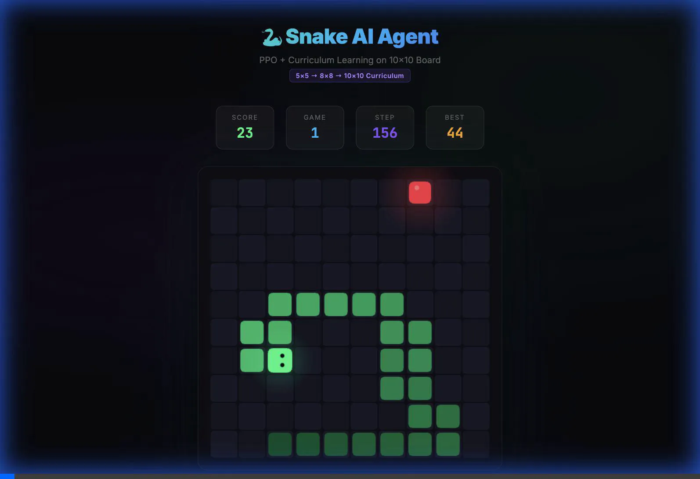

# 🐍 Snake RL: Zero to Hero

[](https://saheb.github.io/rl-snake/snake_learning_journey.html)
[](https://opensource.org/licenses/MIT)

Mastering Snake with Reinforcement Learning, scaling from a 5x5 grid to a 10x10 board using **Proximal Policy Optimization (PPO)** and **Curriculum Learning**.


*Our final PPO agent navigating a 10x10 board after completing the "Zero to Hero" curriculum.*

---

## 🚀 Experience the Journey

### 1. [Live Interactive Visualization](https://saheb.github.io/rl-snake/snake_learning_journey.html)
Watch the agent evolve through 9 distinct stages of learning. See the difference between basic Tabular Q-Learning and high-performance Deep RL.

### 2. [Interactive Tutorial (From Zero to Hero)](Snake_RL_Tutorial.ipynb)
A step-by-step Jupyter Notebook that takes you from the absolute basics of RL to advanced scaling strategies.
- **The "Accountant" (Value-Based)**: Learn about Q-Learning and DQN (Deep Q-Network).
- **The "Athlete" (Policy-Based)**: Master PPO (Proximal Policy Optimization).

### 3. [Scaling Story (Blog Post)](blog.md)
Read the full story of how we bypassed the "Sparse Reward" trap on 10x10 boards using Imitation Learning and Curriculums.

---

## 📈 The Evolution

| Phase | Strategy | Board | Max Score |
|---|---|---|---|
| **Phase 0** | Tabular Q-Learning | 5x5 | 24 (Perfect) |
| **Phase 1** | Double Q-Learning | 5x5 | 24 (Stable) |
| **Phase 2** | Imitation Learning | 8x8 | 46 (Skilled) |
| **Phase 3** | **Final PPO Master** | **10x10** | **64 (Master)** |

---

## 🛠️ Getting Started

### Installation
This project uses [uv](https://github.com/astral-sh/uv) for lightning-fast dependency management.

```bash
# Clone the repository
git clone https://github.com/saheb/rl-snake.git
cd rl-snake

# Sync dependencies
uv sync

# Or using standard pip
pip install -e .
```

### Key Training Scripts
- `train_tabular_q.py`: Train baseline tabular agents.
- `train_ppo_curriculum.py`: The core curriculum pipeline (5x5 → 8x8 → 10x10).
- `visualize_journey.py`: Records your own agents and generates the HTML visualization.

---

## 🎓 Theory Primers Included
We don't just provide code; we explain the *why*:
- **Actor-Critic** architecture.
- **Proximal Policy Optimization** (PPO) stability.
- **Behavioral Cloning** as a bootstrap.
- **Curriculum Learning** for environment scaling.

---

*Created by Antigravity AI*
