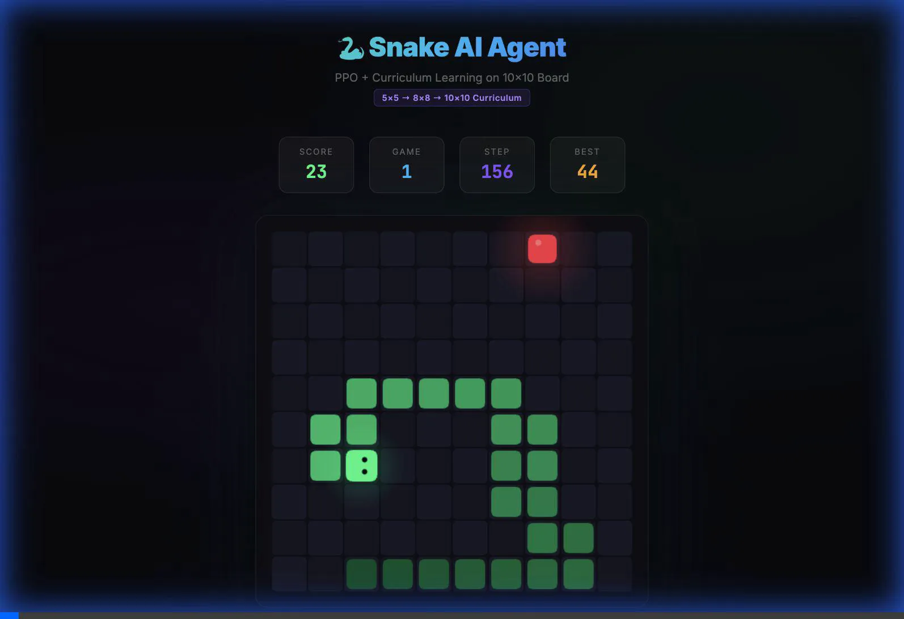
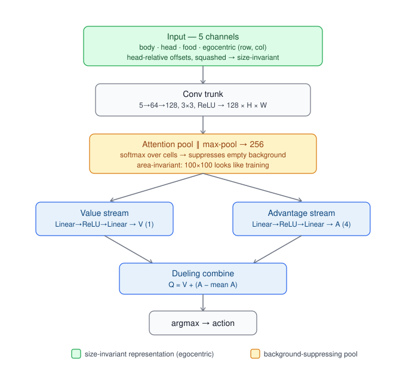

# RL Snake

[](https://molab.marimo.io/github/Saheb/rl-snake/blob/main/notebooks/curiosity.py/wasm)
[](https://opensource.org/licenses/MIT)



A full journey through modern reinforcement learning on the game of Snake — from tabular Q-learning through ConvNets to a mechanistic investigation of **size generalization** — with interactive marimo notebooks, real training logs, and honest empirical results.

---

## Experiments

### 1. Getting Snake to Learn (The Hard Way)

Before anything sophisticated, we established baselines by climbing the RL stack from scratch:

| Algorithm | Notes |
|---|---|
| Tabular Q-Learning | 5×5 board; converges in ~10k episodes |
| REINFORCE | Policy gradient baseline; high variance |
| A2C | Critic stabilises training on 8×8 |
| PPO | On-policy; strong on dense reward |
| PPO + Curriculum | Progressive board growth (5×5 → 10×10) |
| Behaviour Cloning → PPO | Pretrain on human demos; mixed results |
| PPO teacher → DQN student | Knowledge distillation across algorithm families |

These experiments live in `scripts/` as a preserved historical record and are visualised in the [original learning journey demo](assets/snake_learning_journey.html).

---

### 2. Curiosity Killed the Snake

**[Open interactive notebook →](https://molab.marimo.io/github/Saheb/rl-snake/blob/main/notebooks/curiosity.py/wasm)**

An empirical investigation of the Intrinsic Curiosity Module (Pathak et al., 2017) — when does curiosity actually help, and when does it backfire?

We ran a **2 × 3 × 2 × 3** grid (algorithm × reward mode × board × seed):

| Question | Answer |
|---|---|
| Does ICM help DQN with dense reward? | **No** — \|Δ\| < 0.05 |
| Does ICM rescue DQN under sparse reward? | **No** — \|Δ\| < 0.15 |
| Does dense shaping matter for DQN? | **Yes** — ~15% score drop without it |
| Does ICM help PPO under sparse reward? | **Yes** — +24% on `pure_sparse` 10×10 |
| Does ICM increase state coverage? | **No** — both saturate at ~99% |

**The mechanistic takeaway.** ICM is not a free upgrade. DQN's replay buffer dilutes the intrinsic signal across stale transitions; PPO consumes it fresh on every rollout. And even where ICM helps, the gain comes from *reward densification*, not expanded exploration.

---

### 3. Can a ConvNet Beat Hand-Crafted Features?

**[Open interactive notebook →](https://molab.marimo.io/github/Saheb/rl-snake/blob/main/notebooks/convnet.py/wasm)**

The Feature DQN uses 24 hand-crafted features (danger flags, flood-fill, normalized distances). The ConvNet sees only raw 3-channel grid pixels. Which wins?

**Short answer: ConvNet v3 wins decisively — but only after a 30-trial hyperparameter sweep.**

Scores below are **mean food eaten per game** (greedy eval, 3 seeds):

| Algorithm | 10×10 (10k games) | 16×16 (16k games) |
|---|---|---|
| Feature DQN | 5.50 | 5.92 |
| ConvNet v1 (wrong hyperparams) | 1.49 | 0.20 |
| **ConvNet v3 (sweep-tuned)** | **12.32** | **10.83** |

**Key findings:**
- `n_steps=1` universally better with PER — multi-step returns hurt when combined with prioritised replay
- Feature DQN plateaus at ~5.5–6 on both boards regardless of training budget
- ConvNet v3 is still climbing at 10k games on 10×10; there is no plateau in sight
- RND (Random Network Distillation) exploration bonus: **null result** — saturation on sparse boards

The v1 ConvNet's 0.20 score on 16×16 looked like architectural failure. It was actually a budget failure: 128 gradient updates/game vs 3,000 for Feature DQN, and an epsilon schedule that forced exploitation before the network had learned anything useful. Fix those, and the ConvNet wins 2× on every metric.

---

### 4. Does a Small-Board Agent Work on a Big Board?

**[Full investigation → `size_transfer/`](size_transfer/README.md)**

A "size-agnostic" ConvNet (fully convolutional + global pooling, so it *runs* on any board) trained on 6×6 *should* play 16×16 — same game, bigger board. It doesn't: it random-walks by board ~16. This is a deep dive into **why**, ending in a fix.

**Short answer: single-size training never covers the big-board state distribution — and once you fix *both* the representation and the coverage, one agent trained on boards 6–22 plays 100×100 zero-shot.**

| board (zero-shot) | 6 | 16 | 32 | 64 | **100** |
|---|---|---|---|---|---|
| single-size (6×6) agent — toward-food% | 87% | 51% | 50% | 50% | 50% |
| single-size (10×10) agent — toward-food% | 92% | 59% | 50% | 50% | 50% |
| **curriculum agent (6–22) — toward-food%** | 88% | — | 96% | 98% | **98%** |

*toward-food% = fraction of greedy moves that reduce Manhattan distance to food (50% = chance). The curriculum agent also **eats ~86 food per game on 100×100**, a board it never trained on.*

A **bigger single training board just moves the cliff outward** — a 6×6 agent is at chance by board 16, a 10×10 agent by ~32 — but neither reaches 100. Only training across a *range* of sizes removes the cliff. (The egocentric representation helps too: a single-size 10×10 *egocentric* agent holds to ~32 before fading — further than the plain baseline, but still not 100 without coverage.)

**What changed from the base ConvNet** (the setup this phase evolved):
- **Head:** replaced the board-size-locked `flatten → Linear` head with a size-agnostic **global-pooling** head — this is what lets a single network *run* on any board size.
- **Input:** **egocentric** channels — each cell carries its *head-relative* (row, col) offset (squashed), not just absolute pixels — making food direction size-invariant.
- **Pooling:** **attention pooling** (softmax over cells) alongside max-pool, so the growing empty background doesn't dilute the signal.
- **Training:** a **curriculum over board sizes 6–22** (per-size replay buffers), **dense distance-shaped reward**, and hard periodic target updates.



**Key findings:**
- **Decodable ≠ used.** The pooled representation still encodes food-direction at every size (a refit probe reads it at 0.90), yet the frozen policy can't act on it — the food-steering *margin* collapses 5× while the danger margin stays invariant.
- **Probe fixes ≠ behaviour fixes.** Architectural changes (attention pooling, coordinate channels) each *improved their mechanistic probe* while doing nothing — or hurting — real-play transfer. A cautionary tale about probe-guided design.
- **Root cause is coverage, not architecture.** 71–88% of big-board play is *outside* the 6×6 training support — "far from all walls" is geometrically impossible on 6×6 yet dominates big boards. No architectural trick fixes a policy on states it never saw.
- **The fix.** A size-invariant *representation* (egocentric relative coordinates + attention pooling — big boards *look* like training near the head) **plus** training *coverage* across a size range → clean extrapolation 4.5× past the largest training board.
- **Performance *rises* with board size** because larger boards remove constraints: wall interactions fall 54%→1%, collision rate ~22× lower, survival ~90× longer.

The full narrative — every probe, ablation, and dead-end — is in [`size_transfer/FINDINGS.md`](size_transfer/FINDINGS.md).

**Try it yourself.** The trained agent ships in the repo — [`size_transfer/curriculum_ego_best.pth`](size_transfer/curriculum_ego_best.pth) (824 KB, ~209K params). Pick any board size and watch it play:

[](https://colab.research.google.com/github/Saheb/rl-snake/blob/main/notebooks/size_generalization_colab.ipynb) — runs in the browser, no install.

Or locally with the marimo notebook:

```bash
uv run marimo edit notebooks/size_generalization.py
```

---

## Results at a Glance

```
Mean Score (10×10, 10k games, 3 seeds)
━━━━━━━━━━━━━━━━━━━━━━━━━━━━━━━━━━━━━
ConvNet v3      ████████████████████████  12.32
Feature DQN     ██████████                 5.50
ConvNet v1      ██                         1.49
Random          ▌                          0.07
```

```
Mean Score (16×16, 16k games)
━━━━━━━━━━━━━━━━━━━━━━━━━━━━━━━━━━━━━
ConvNet v3      ████████████████████       10.83
Feature DQN     ██████████                  5.92
ConvNet v1      ▌                           0.20
```

```
Zero-shot transfer to 100×100  (toward-food %, never trained above 22)
━━━━━━━━━━━━━━━━━━━━━━━━━━━━━━━━━━━━━━━━━━━━━━━━━━━━━━━━━━━━━━━
curriculum ego agent   █████████████████████████  98%
single-size (6×6) agent ████████████▌              50%  (= chance)
```

---

## The Notebooks

| Notebook | What it covers | Run it |
|---|---|---|
| [`curiosity.py`](notebooks/curiosity.py) | ICM on DQN + PPO, 2×3×2×3 ablation, death-oversampling trap, terminal-mask fix | [](https://molab.marimo.io/github/Saheb/rl-snake/blob/main/notebooks/curiosity.py/wasm) |
| [`convnet.py`](notebooks/convnet.py) | Feature DQN vs ConvNet, hyperparameter sweep, RND ablation, architecture walkthrough | [](https://molab.marimo.io/github/Saheb/rl-snake/blob/main/notebooks/convnet.py/wasm) |
| [`size_generalization.py`](notebooks/size_generalization.py) | Play the cross-size agent on any board 6→100 zero-shot (loads the shipped 824 KB model) | [](https://colab.research.google.com/github/Saheb/rl-snake/blob/main/notebooks/size_generalization_colab.ipynb) · or `uv run marimo edit` locally |

---

## Running Locally

```bash
git clone https://github.com/Saheb/rl-snake.git
cd rl-snake
uv sync
uv run marimo edit notebooks/curiosity.py            # ICM investigation
uv run marimo edit notebooks/convnet.py              # ConvNet investigation
uv run marimo edit notebooks/size_generalization.py  # play the cross-size agent (6→100)
```

### Key Scripts

| Script | What it does |
|---|---|
| `scripts/train_dqn.py` | Feature DQN + PER + optional ICM |
| `scripts/train_dqn_conv.py` | ConvNet DQN v3 (sweep-tuned hyperparameters) |
| `scripts/train_dqn_conv_rnd.py` | ConvNet + RND exploration bonus |
| `scripts/train_ppo.py` | PPO + optional ICM |
| `scripts/run_convnet_v3_16x16.sh` | Reproduces 16×16 ConvNet v3 results |
| `scripts/run_featuredqn_longrun.sh` | Reproduces Feature DQN 10k/16k-game baselines |
| `scripts/size_transfer.py` | Size-agnostic net + zero-shot transfer curve (the size-generalization starting point) |
| `scripts/size_curriculum.py` | The cross-size agent: egocentric arch + curriculum → 100×100 zero-shot |
| `scripts/size_*.py` | The full size-generalization investigation (probes, ablations, fixes — see [`size_transfer/README.md`](size_transfer/README.md)) |
| `sweeps/convdqn_sweep.yaml` | W&B sweep config (30-trial random search) |
| `utils/rnd.py` | RND target/predictor with running reward normalisation |
| `utils/icm.py` | ICM encoder, inverse model, forward model |

Earlier experiments (tabular Q, REINFORCE, A2C, PPO curriculum, behaviour cloning, knowledge distillation) are in `scripts/` as a record of the full project history.

---

## Project Structure

```
rl-snake/
├── notebooks/
│   ├── curiosity.py        # ICM investigation (interactive)
│   └── convnet.py          # ConvNet investigation (interactive)
├── scripts/                # All training scripts (incl. size_*.py — size generalization)
├── size_transfer/          # Size-generalization investigation: FINDINGS.md, figures, trained agent
│   ├── README.md           # Index + reproduce guide
│   └── FINDINGS.md         # Full narrative (probes, ablations, fixes)
├── utils/
│   ├── icm.py              # Intrinsic Curiosity Module
│   ├── rnd.py              # Random Network Distillation
│   └── per.py              # Prioritised Experience Replay
├── pilot_logs/             # Raw training logs (all experiments)
├── sweeps/                 # W&B sweep configs
├── assets/                 # Charts, replay demos
└── envs/
    └── snake_game.py       # Snake environment
```

---

*Curiosity notebook based on "Curiosity-driven Exploration by Self-supervised Prediction", Pathak et al., ICML 2017.*  
*ConvNet experiments inspired by "Human-level control through deep reinforcement learning", Mnih et al., Nature 2015.*
