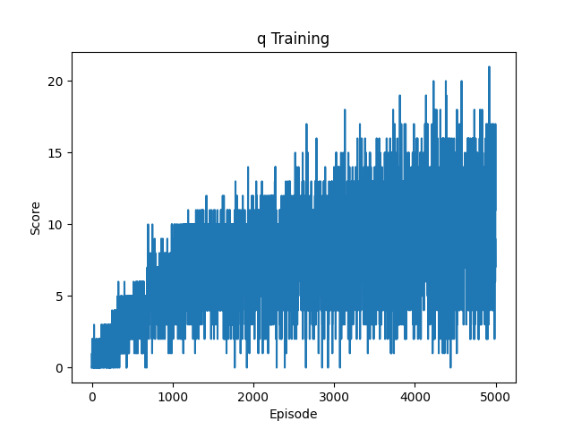
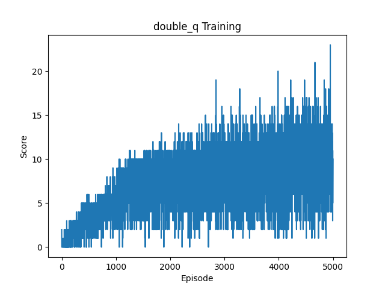

# Scaling Snake AI: From Random Wiggles to Strategic Mastery

**The story of how we trained a Reinforcement Learning agent to master Snake on a 10×10 board — and everything that went wrong along the way.**

---

## 🐣 A Quick Primer: What is RL?

If you're new to AI, Reinforcement Learning (RL) is simply **learning by trial and error**. An agent (our snake) takes actions in an environment and gets rewards (food) or punishments (hitting a wall). Over time, it figures out which actions lead to the best outcomes.

```
   Agent ──action──▶ Environment
     ▲                  │
     └──state, reward◀──┘
```

There are two main approaches to building an RL "brain":

**1. Value-Based — "The Accountant"**
The AI calculates the exact worth of every move. "Is turning left worth 10 points or 2?" The famous algorithm here is **DQN (Deep Q-Network)** — "Q" stands for "Quality," as in "what's the quality of this move?"

**2. Policy-Based — "The Athlete"**
The AI learns general instincts. "If there's a wall ahead, turn." It doesn't calculate value; it just knows the right response. The famous algorithm is **PPO (Proximal Policy Optimization)** — "Proximal" means it makes small, safe updates so it doesn't "crash" while learning.

Both approaches have their strengths, and our journey would test them both.

---

## 📉 Phase 0: The Baseline (5×5 Board)

We started with **classic Tabular Q-Learning** — the simplest "Accountant" approach. The agent maintains a literal table mapping every situation to the expected reward of each action.

| Agent | Mean Score | Max Score | # States in Table |
|---|---|---|---|
| **Q-Learning** | ~11.0 | 24 (Perfect!) | ~2,000 |
| **Double Q-Learning** | ~14.0 | 24 (More stable) | ~2,000 |

**Double Q-Learning** is a clever improvement: instead of one table, it keeps *two* and cross-checks them. This avoids the tendency to be *overconfident* about untested moves — a problem called "maximization bias."

On a tiny 5×5 board (max score: 24), both agents perform well. The Q-table only needs ~2,000 entries. Problem solved?




Not quite.

---

## 🚧 The Wall: Why Tables Don't Scale

We tried the same approach on a **10×10 board**. Total failure.

The problem is twofold:

**1. State Space Explosion**
A 5×5 board has manageable complexity. A 10×10 board has an astronomically larger state space. You can't memorise a table for every possible configuration.

**2. Sparse Rewards**
On a 5×5 board, a random snake bumps into food accidentally within a few steps. On a 10×10 board, it might wander for **1,000 steps** without ever eating. With no positive signal, the agent has nothing to learn from.

We needed to think differently.

---

## 💡 The Solution: A Triple Threat

To conquer the 10×10 board, we combined three advanced techniques:

### 1. PPO — The Neural Network Brain

We switched from a memory table to a **neural network** that outputs action *probabilities*. This is PPO (Proximal Policy Optimization), a policy-gradient algorithm.

**Why PPO works here:**
- It **generalises**: similar board states get similar responses, even if they've never been seen before
- It's **stable**: the "proximal" constraint prevents wild swings in behaviour between updates
- It's **policy-based**: it directly learns "what to do," which transfers better between board sizes

The network architecture is an **Actor-Critic** design:
- **Actor head**: "What should I do?" → outputs probabilities for [Straight, Turn Right, Turn Left]
- **Critic head**: "How good is my current situation?" → outputs a single value estimate
- **Shared backbone**: both heads share the same feature extraction layers

### 2. Imitation Learning — The Instinct

Before exploring on its own, we let the PPO agent **watch an expert play**. The expert was a REINFORCE algorithm trained on the 5×5 board. We recorded its gameplay and pre-trained the PPO network to mimic those moves — a technique called **Behavioral Cloning**.

This gave the agent *survival instincts* from day one: avoid walls, move toward food. Without this, PPO on 10×10 would find nothing to learn from (the sparse reward problem again).

> **Surprising finding**: We also tried using DQN as the expert. DQN demos gave **96% behavioral cloning accuracy** (vs. REINFORCE's 82%), but PPO performed *worse* with them!
>
> Why? REINFORCE and PPO are both policy-gradient methods — they "think" the same way. DQN is value-based with a fundamentally different decision structure. **Algorithm compatibility matters more than imitation accuracy.**

### 3. Curriculum Learning — The Growth

We didn't start on the 10×10 board. Instead, we used a curriculum:

```
5×5 (Easy)  →  8×8 (Medium)  →  10×10 (Goal)
    ↑               ↑               ↑
  Master         Transfer         Transfer
  basics         + adapt          + master
```

At each stage, we collect new expert demonstrations and fine-tune. The neural network's weights carry forward, so skills learned on small boards transfer to larger ones.

---

## ❌ What Didn't Work

The failures were just as instructive as the successes:

| Approach | Board | Best | Mean | What Went Wrong |
|---|---|---|---|---|
| **A2C** (Actor-Critic, no clipping) | 5×5 | 4 | 0.2 | The Bootstrap Trap: critic is wrong early → actor trusts wrong signals → both spiral |
| **Vanilla PPO** (no imitation) | 5×5 | 4 | 0.35 | Same trap — without expert guidance, there's no learning signal in sparse reward environments |
| **PPO + DQN expert demos** | 8×8 | 42 | 6.4 | High clone accuracy (96%) but bad transfer: value-based → policy-based mismatch |
| **Direct 10×10** (no curriculum) | 10×10 | ~5 | ~1 | Too large a jump from 5×5 — the agent "forgot" its skills |

The lesson: **the path matters as much as the algorithm**.

---

## 🏆 The Final Results

Our triple-threat agent showed a clear evolutionary arc:

| Phase | Strategy | Board | Best Score | Mean Score |
|---|---|---|---|---|
| ? | Random Agent | 5×5 | ~2 | ~0.3 |
| 0 | Tabular Q-Learning | 5×5 | 24 | ~11 |
| 0+ | Double Q-Learning | 5×5 | 24 | ~14 |
| 1 | PPO + Imitation | 5×5 | 24 | ~20 |
| 2 | Curriculum → 8×8 | 8×8 | 46 | ~12 |
| **3** | **Curriculum → 10×10** | **10×10** | **64** | **~18** |

The agent fills over **60%** of a 10×10 board. It plans long-term paths, avoids trapping itself, and navigates efficiently. Not bad for a snake that started with random wiggles.

---

## 🎬 See It in Action

- **[Live Interactive Visualization](../assets/snake_learning_journey.html)** — Watch all 9 stages of evolution
- **[Tutorial Notebook](https://github.com/Saheb/rl-snake/blob/main/docs/Snake_RL_Tutorial.ipynb)** — Run the code yourself
- **`snake_10x10_replay.html`** — Watch the best 10×10 games

---

## 🔑 Key Takeaways

1. **Tables don't scale** — Neural networks are essential for large state spaces
2. **Sparse rewards need bootstrapping** — Imitation learning provides the initial signal
3. **Algorithm compatibility > clone accuracy** — Policy→Policy transfer beats Value→Policy
4. **Curriculum learning works** — Incremental difficulty lets knowledge transfer naturally
5. **Failures are data** — A2C and vanilla PPO taught us about the bootstrap trap

---

*Built with PyTorch, curiosity, and a lot of dead snakes. 🐍*
